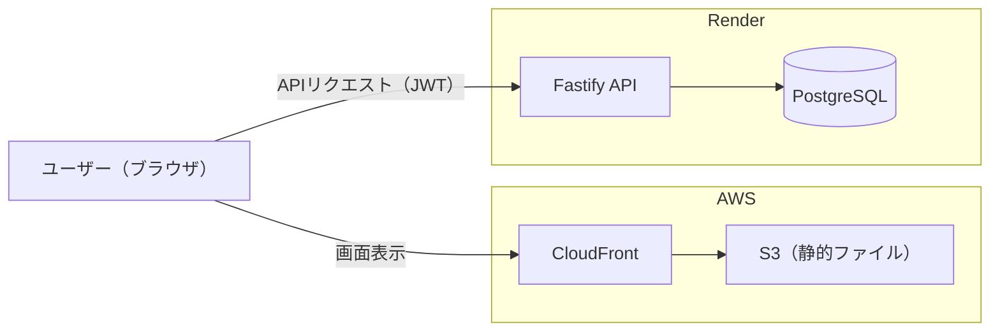
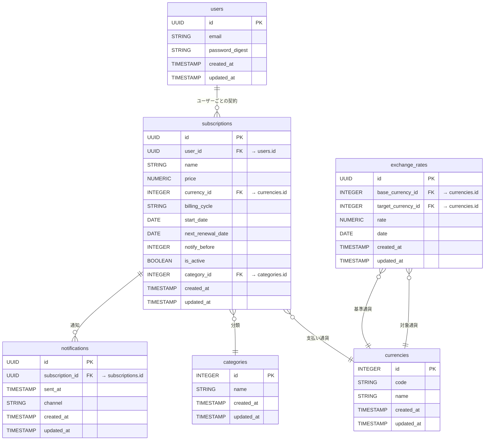

# track-my-subs

個人のサブスクリプション契約を管理・可視化するWebアプリ。

## デモ

- **URL:** https://d10k5af6gcnz45.cloudfront.net
- **メール:** demo@example.com
- **パスワード:** Demo1234!

このデモアカウントは検証用に複数人で共有しているため、実際の個人情報は登録しないでください。

---

## このアプリについて

契約しているサブスクリプションが増えると、いつ・いくら支払っているかが把握しづらくなり、更新日を忘れて不要なサービスを解約しそびれることがある。track-my-subsは、複数のサブスクリプションを1箇所にまとめて登録し、カテゴリ・通貨・請求サイクルごとに整理して支払い状況を一覧できるようにするためのアプリ。

---

## 主な機能

- サブスクリプションの登録・編集・削除・一覧表示
- カテゴリ・通貨・請求サイクル（月額 / 年額）による分類
- 更新日の指定日前に通知するための設定
- メールアドレスでの登録・ログイン（JWT認証）
- スマートフォンでも利用できるレスポンシブ対応

---

## アーキテクチャ



---

## データベース設計



テーブル定義（SQL）などの詳細は [doc/er-diagram.md](doc/er-diagram.md) を参照。

---

## 技術スタック

| カテゴリ | 技術 |
| --- | --- |
| フロントエンド | React + TypeScript + Vite |
| バックエンド | Fastify + TypeScript |
| データベース | PostgreSQL / Prisma ORM |
| デプロイ | フロントエンド: AWS S3 + CloudFront / バックエンド・DB: Render |

### モノレポ構成

```
track-my-subs/
├── packages/
│   ├── frontend/   # React + Vite
│   ├── backend/    # Fastify
│   └── shared/     # 共有型定義
└── ...
```

---

## ローカル開発

### 必要なもの

- Node.js 22+
- pnpm
- Docker（PostgreSQL 用）

### セットアップ

```bash
git clone https://github.com/ueferi/track-my-subs.git
cd track-my-subs
pnpm install
```

```bash
# PostgreSQL を起動
docker compose up -d
```

`.env.example` をコピーして `.env` を作成してください。

```bash
cp packages/backend/.env.example packages/backend/.env
cp packages/frontend/.env.example packages/frontend/.env
```

`packages/backend/.env` は、`DATABASE_URL`（ローカルDBの接続情報）と `JWT_SECRET`（任意の文字列）を環境に合わせて変更してください。

```bash
# DB マイグレーション & seed
cd packages/backend
pnpm db:migrate
pnpm db:seed

# 開発サーバー起動
# ターミナル1（バックエンド）
cd packages/backend && pnpm dev

# ターミナル2（フロントエンド）
cd packages/frontend && pnpm dev
```

フロントエンド: http://localhost:5173
バックエンド: http://localhost:3000
