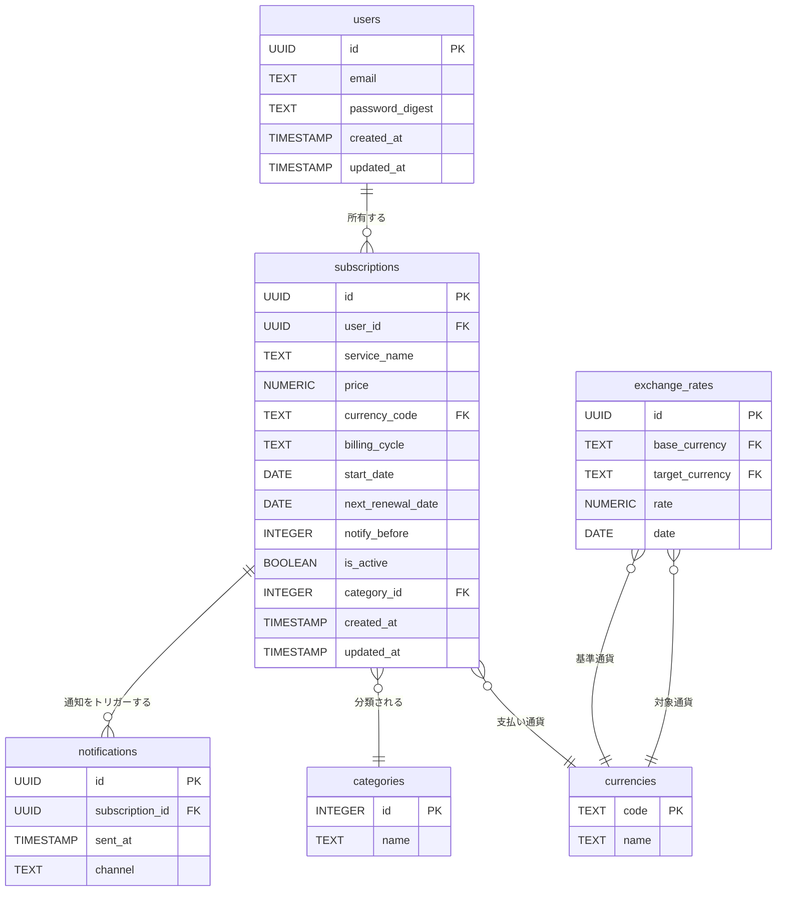

# DB設計

## テーブル構成

テーブルは下記の構成とする



## テーブル定義

テーブル定義は下記のSQLにて行う

```sql
CREATE TABLE users (
  id UUID PRIMARY KEY DEFAULT gen_random_uuid(),
  email TEXT UNIQUE NOT NULL,
  password_digest TEXT NOT NULL,
  created_at TIMESTAMP NOT NULL DEFAULT now(),
  updated_at TIMESTAMP NOT NULL DEFAULT now()
);

CREATE TABLE categories (
  id SERIAL PRIMARY KEY,
  name TEXT NOT NULL
);

CREATE TABLE currencies (
  code TEXT PRIMARY KEY, -- 例: 'USD', 'JPY'
  name TEXT NOT NULL     -- 例: 'USドル', '日本円'
);

CREATE TABLE subscriptions (
  id UUID PRIMARY KEY DEFAULT gen_random_uuid(),
  user_id UUID REFERENCES users(id) ON DELETE CASCADE,
  service_name TEXT NOT NULL,
  price NUMERIC(10, 2) NOT NULL,
  currency_code TEXT REFERENCES currencies(code),
  billing_cycle TEXT NOT NULL, -- 例: 'monthly', 'yearly'
  start_date DATE NOT NULL,
  next_renewal_date DATE NOT NULL,
  notify_before INTEGER DEFAULT 7,
  is_active BOOLEAN DEFAULT TRUE,
  category_id INTEGER REFERENCES categories(id),
  created_at TIMESTAMP NOT NULL DEFAULT now(),
  updated_at TIMESTAMP NOT NULL DEFAULT now()
);

CREATE TABLE notifications (
  id UUID PRIMARY KEY DEFAULT gen_random_uuid(),
  subscription_id UUID REFERENCES subscriptions(id) ON DELETE CASCADE,
  sent_at TIMESTAMP,
  channel TEXT DEFAULT 'email' -- 他の通知方法に対応するための拡張性を考慮
);

CREATE TABLE exchange_rates (
  id UUID PRIMARY KEY DEFAULT gen_random_uuid(),
  base_currency TEXT NOT NULL REFERENCES currencies(code),
  target_currency TEXT NOT NULL REFERENCES currencies(code),
  rate NUMERIC(10, 4) NOT NULL,
  date DATE NOT NULL
);
```
